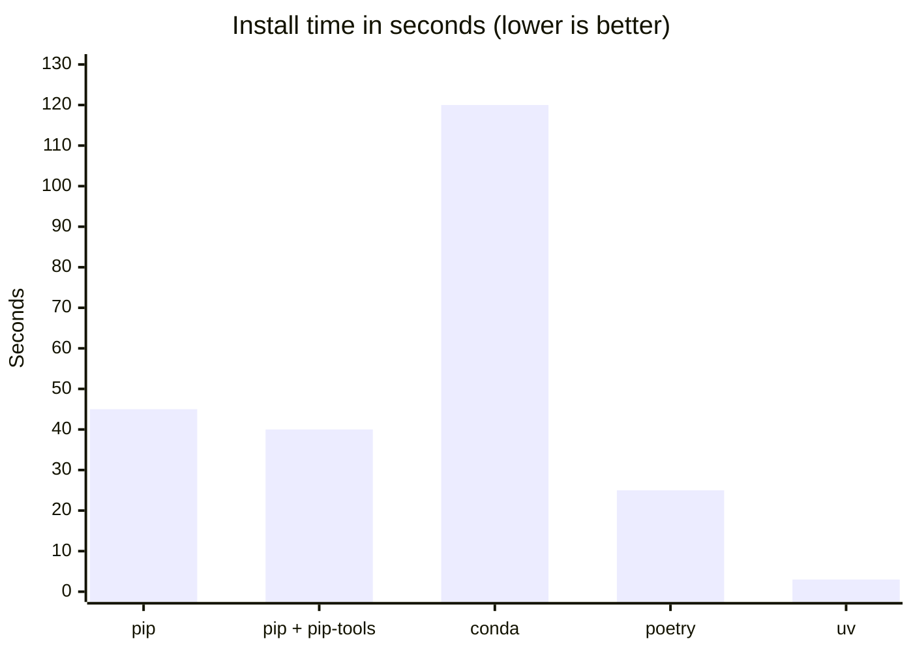

# Project Setup

Depsight uses two modern tools to manage its project configuration and dependencies: **`pyproject.toml`** as the single configuration file and **`uv`** as the package manager. Together they replace a fragmented collection of legacy files and deliver a fast, reproducible workflow.

---

## Project Configuration

### From Many Files to One

Older Python projects spread configuration and dependency information across multiple files, each serving a narrow purpose:

| Legacy file | Purpose |
|-------------|---------|
| `setup.py` | Build script — imperative Python code just to declare metadata |
| `setup.cfg` | Declarative metadata for setuptools (a second config file for the same tool) |
| `requirements.txt` | Dependency pinning — duplicated what `setup.py` already declared |
| `requirements-dev.txt` | Dev dependency pinning — yet another file |
| `MANIFEST.in` | Source distribution file list |
| `tox.ini` / `.flake8` / `mypy.ini` | Per-tool configuration scattered in separate files |

The result was that changing a dependency meant editing two or three files, onboarding required reading a README to know which files mattered, and tools frequently disagreed because they each read from different sources.

The **`pyproject.toml`** was standardised in [PEP 517](https://peps.python.org/pep-0517/), [PEP 518](https://peps.python.org/pep-0518/), and [PEP 621](https://peps.python.org/pep-0621/) to unify all of this into a single declarative file. It is the current standard and is supported by every modern Python packaging tool.

---

### Package Metadata and Build System

The `[project]` table declares the package name, version, description, and runtime dependencies — everything that used to live across `setup.py` and `setup.cfg`. The `[build-system]` table tells tools like `uv build` or `pip wheel` which backend to use. The `[tool.*]` tables configure linters, formatters, and test runners — all in the same file:

```toml
[project]
name = "depsight"
version = "0.1.0"
description = "A modular dependency analysis framework"
dependencies = [
    "click>=8.1.7",
    "rich>=13.7.0",
    "rich-click>=1.7.0",
]

[build-system]
requires = ["setuptools>=61.0"]
build-backend = "setuptools.build_meta"

[dependency-groups]
dev = [
    "mypy>=1.10",
    "pytest>=8.0",
    "ruff>=0.4",
]
docs = [
    "mkdocs>=1.6",
    "mkdocs-material>=9.5",
    "mkdocs-mermaid2-plugin>=1.1",
]

[tool.pytest.ini_options]
testpaths = ["tests"]
pythonpath = ["src"]

[tool.ruff]
line-length = 120

[tool.ruff.lint]
select = ["E", "F", "I"]
ignore = ["E501"]

[tool.mypy]
strict = true
ignore_missing_imports = true
```

### Dependency Groups

Groups isolate development and documentation tools from the runtime dependencies, replacing `requirements-dev.txt` and similar files:

| Group | Contents | Install command |
|-------|----------|----------------|
| **Runtime** | Click, Rich, rich-click | `uv sync` |
| **Dev** | Ruff, mypy, pytest | `uv sync --group dev` |
| **Docs** | MkDocs, Material theme, Mermaid | `uv sync --group docs` |
| **All** | Everything above | `uv sync --all-groups` |

### Tool Configuration

Linters, formatters, and test runners read their settings from `pyproject.toml` under `[tool.<name>]`, eliminating the need for `tox.ini`, `.flake8`, `mypy.ini`, and similar files.

#### Test Runner

Automated tests verify that the code behaves as expected and catch regressions before they reach other developers or production. Without a test runner, verifying correctness means manually re-running the application after every change — which does not scale and is error-prone. Depsight uses [pytest](https://docs.pytest.org/). A basic test looks like this:

```python
# tests/test_math.py
def add(a: int, b: int) -> int:
    return a + b

def test_add() -> None:
    assert add(2, 3) == 5
    assert add(-1, 1) == 0
```

Running `python -m pytest tests/` discovers and executes all `test_*` functions automatically.

#### Linter and Formatter

A linter catches common mistakes — unused imports, undefined variables, unreachable code — before they cause bugs at runtime. A formatter enforces a consistent code style automatically, eliminating style debates in code reviews and keeping the diff history clean. Configuring both as part of the project means every contributor gets the same rules, regardless of their local editor setup. Depsight uses [Ruff](https://docs.astral.sh/ruff/), a Rust-based tool that replaces flake8, isort, and black in one binary. Running `ruff check` on the following code:

```python
import os  # unused import
import sys

x=1+2      # missing whitespace around operator
print(x)
```

produces:

```
error[F401]: `os` imported but unused
error[E225]: missing whitespace around operator
```

Both issues are caught before the code is ever run or reviewed.

#### Type Checker

Python is dynamically typed, which means type errors only surface at runtime — often in production, and often in error paths that are rarely exercised. A static type checker analyses the code without running it, catching type mismatches, missing attributes, and incorrect function signatures early. For a project like Depsight that exposes a plugin API, type annotations also serve as living documentation — callers know exactly what a function expects and returns. Depsight uses [mypy](https://mypy.readthedocs.io/). Running `mypy` on the following code:

```python
def greet(name: str) -> str:
    return "Hello, " + name

result: int = greet("world")  # assigned to int, but greet returns str
print(result.upper())         # int has no upper() — runtime crash waiting to happen
```

produces:

```
error: Incompatible types in assignment (expression has type "str", variable has type "int")
```

The bug is caught statically — no test run required.

---

## uv — Python Package Manager

Depsight uses [**uv**](https://docs.astral.sh/uv/) instead of pip. uv is written in Rust and designed as a drop-in replacement for pip and pip-tools, but drastically faster and with a proper lockfile workflow out of the box.

### Why uv?

`pip` was built in an era before lockfiles, dependency groups, or fast resolution were priorities. Installing a moderately sized project with pip can take tens of seconds due to serial network requests and a slow resolver. `conda` solves environment isolation but is slow and heavyweight. `venv` + `pip-tools` gets closer but requires two tools and manual coordination.

`uv` addresses all of this in a single binary:

- **Lockfile by default** — `uv sync` generates `uv.lock`, pinning every transitive dependency. No separate `pip-compile` step needed.
- **Dependency groups** — dev and docs dependencies are first-class, defined directly in `pyproject.toml`.
- **Speed** — The resolver and installer are written in Rust with parallel downloads and a shared package cache.

### Performance

The chart below shows approximate real-world install times for a typical mid-size Python project (50–100 packages):



Of the tools above, only `pip-tools`, `poetry`, and `uv` produce a proper lockfile. `pip freeze` is a manual snapshot, not a managed lockfile, and `conda`'s `environment.yml` does not pin transitive dependencies.

### Common Commands

```bash
# Install all dependencies (including dev and docs groups)
uv sync --all-groups

# Add a new runtime dependency
uv add <package>

# Add a dev dependency
uv add --group dev <package>

# Build a distributable wheel
uv build

# Run a command inside the managed environment
uv run depsight --help
```

### Lockfile

`uv sync` generates a `uv.lock` file that pins exact versions of every transitive dependency. This file is committed to version control so that every developer, every CI run, and every production build installs exactly the same packages:

```toml
[[package]]
name = "click"
version = "8.3.1"
source = { registry = "https://pypi.org/simple" }

[[package]]
name = "rich"
version = "13.9.4"
source = { registry = "https://pypi.org/simple" }
```