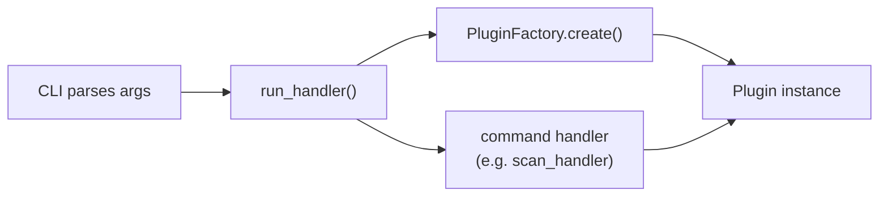

# Terminal Applications

## Overview

A terminal application is any program that runs inside a terminal emulator and communicates through text input and output rather than a graphical window. The two most common forms are **CLI** (command-line interface) applications, where the user passes arguments and flags to a single command, and **TUI** (text-based user interface) applications, which render interactive panels, menus, and widgets directly in the terminal.

Terminal applications exist across virtually every programming language. Go projects use [Cobra](https://github.com/spf13/cobra) and [Bubble Tea](https://github.com/charmbracelet/bubbletea), Rust has [clap](https://github.com/clap-rs/clap) and [Ratatui](https://github.com/ratatui/ratatui), Node.js offers [Commander](https://github.com/tj/commander.js) and [Ink](https://github.com/vadimdemedes/ink), and Python provides Click, Rich, and Textual, among many others. The pattern is the same everywhere: a framework handles argument parsing, output rendering, and terminal interaction so the developer can focus on application logic.

Python projects in particular rely heavily on CLIs. Package managers (`pip`, `uv`), linters (`ruff`, `flake8`), test runners (`pytest`), and build tools (`hatch`, `flit`) are all CLI applications. This makes them ideal for CI/CD pipelines, where every step is a shell command and there is no graphical display available. A tool like Depsight fits naturally into this ecosystem: it analyses dependency files, produces structured output, and integrates into automated workflows without any special setup.

Modern terminal emulators have made this category of applications far more capable than the plain-text terminals of the past. [Windows Terminal](https://github.com/microsoft/terminal), [iTerm2](https://iterm2.com/), [Alacritty](https://alacritty.org/), [Kitty](https://sw.kovidgoyal.net/kitty/), and [Warp](https://www.warp.dev/) all support true-colour rendering (16 million colours), Unicode and emoji, ligature fonts, and GPU-accelerated drawing. These capabilities allow terminal applications to display rich tables, syntax-highlighted code, progress bars, and even interactive layouts that approach the visual quality of graphical interfaces.

---

## Python CLI and TUI Frameworks

### Click

[Click](https://click.palletsprojects.com/) is the most widely used Python library for building command-line interfaces. Instead of manually parsing `sys.argv`, a developer decorates a function and Click handles argument parsing, type conversion, help generation, and error reporting:

```python
import click

@click.command()
@click.option("--name", required=True, help="Your name.")
def greet(name):
    """Say hello."""
    click.echo(f"Hello, {name}!")
```

Running `python greet.py --help` produces formatted help text automatically. Click also supports **command groups**, a top-level entry point with multiple subcommands, which is the standard pattern for larger tools that expose several operations under a single program name.

### Rich

[Rich](https://rich.readthedocs.io/) is a Python library that renders styled text, tables, progress bars, tree views, and syntax-highlighted code directly in the terminal using ANSI escape codes. It works in every modern terminal emulator without any external dependencies.

[rich-click](https://github.com/ewels/rich-click) is a drop-in wrapper around Click that replaces Click's default help output with Rich-powered rendering — coloured headings, styled option tables, and syntax-highlighted usage lines — without changing any application logic. Swapping the import is all it takes:

```python
import rich_click as click
```

### Textual

[Textual](https://textual.textualize.io/) is a TUI framework built on top of Rich by the same team. While Rich focuses on styled output for CLI applications, Textual provides a full widget toolkit for building interactive terminal applications with buttons, input fields, data tables, and layout containers. It uses a CSS-like styling system and an async event loop, making it closer to a frontend framework than a traditional CLI library. Tools like [Posting](https://github.com/darrenburns/posting) (an API client) and [Trogon](https://github.com/Textualize/trogon) (a CLI-to-TUI converter) demonstrate what Textual is capable of.

### Scalable Project Structure

As a CLI application grows beyond a single command, its structure needs to scale with it. A common pattern is to separate the interface layer from the business logic so that command handlers remain thin and testable. The CLI module is responsible for parsing arguments and rendering output, while a service or handler layer performs the actual work.

For tools that support multiple domains or ecosystems, a plugin-based architecture is effective. Each plugin registers its own command group, and the CLI discovers and mounts them dynamically at startup. This allows new functionality to be added, either internally or by third-party packages, without modifying the core CLI code.

```
my_tool/
├── cli.py                  # Entry point: registers command groups, sets up rich-click
├── run.py                  # Dispatcher: routes CLI arguments to the correct handler
├── commands/
│   ├── __init__.py
│   └── scan/
│       ├── __init__.py
│       ├── scan_command.py # Click command definition (thin: parse args, call handler)
│       └── scan_handler.py # Business logic (no Click dependency, easy to unit test)
├── core/
│   ├── __init__.py
│   ├── factory.py          # PluginFactory: resolves plugin name → plugin instance
│   └── plugins/
│       ├── __init__.py
│       ├── base.py         # Abstract base class all plugins must implement
│       ├── npm/
│       │   └── npm.py
│       └── uv/
│           └── uv.py
└── utils/
    ├── logger.py
    └── constants.py        # Colour tokens, shared string constants
```

Depsight follows exactly this pattern. Its CLI is built with Click and Rich, uses a plugin registry to generate subcommand groups at import time, and delegates all command execution to a central dispatcher that is decoupled from the CLI framework. The following sections describe this structure in detail.

---

## Depsight's CLI

### Entry Point

The CLI entry point is registered in `pyproject.toml`:

```toml
[project.scripts]
depsight = "depsight.cli:main"
```

After installation, typing `depsight` in a terminal calls the `main()` function in `cli.py`.

### Command Hierarchy

Depsight uses a two-level command hierarchy. The top-level group is `depsight`, and each plugin registers itself as a **subgroup** with its own commands:

```
depsight
├── uv
│   └── scan --project-dir <path> [--verbose] [--as-csv]
└── vsce
    └── scan --project-dir <path> [--verbose] [--as-csv]
```

This structure is generated dynamically at import time — the CLI iterates over every plugin in the registry and creates a Click group for each one:

```python
for plugin_name in SUPPORTED_PLUGINS:
    _register_plugin(plugin_name)
```

When a third-party plugin is installed (e.g. `depsight-npm`), it appears in the registry automatically and gets its own subcommand group without any changes to the Depsight codebase.

### The Run Handler

Commands do not instantiate plugins themselves. Instead, every command delegates to `run_handler()`, which acts as a **dispatcher**:



1. The CLI collects the parsed options into a dict and calls `run_handler()`
2. `run_handler()` uses the `PluginFactory` to create the correct plugin instance
3. The handler function receives the plugin and executes the command logic
4. The exit code (`0` for success, `1` for failure) is returned to the shell

This separation means command handlers never depend on Click directly — they receive a plugin, a path, and a logger, making them straightforward to test without simulating a terminal.

### Styling

Depsight defines a consistent colour scheme for all terminal output:

| Token | Colour | Usage |
|-------|--------|-------|
| `COLOR_DIM_ORANGE` | `#CD853F` (peru) | Commands, headings, table borders |
| `COLOR_PEACH` | `#FFDAB9` (peach-puff) | Arguments, options, highlighted values |

These colours are applied to the CLI help screens via `rich-click` style constants, and to the scan output table via Rich's styling API. The result is a visually consistent interface across all commands and outputs.
