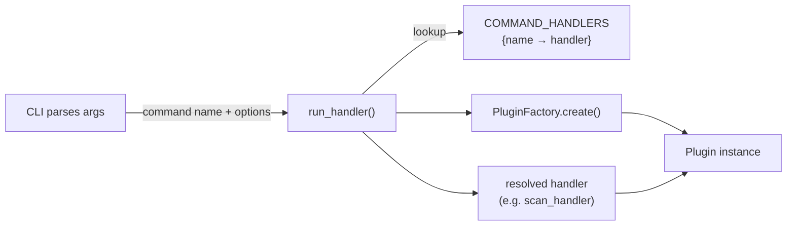
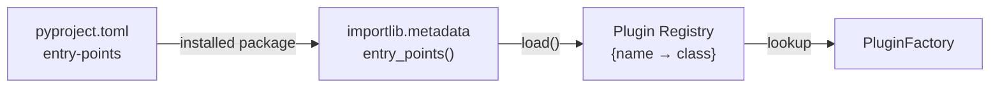
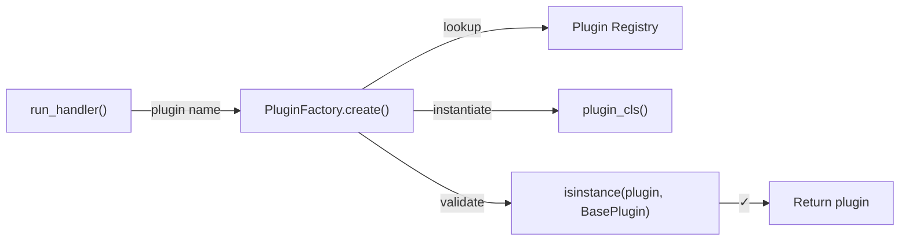

# CLI Architecture

## Overview

One of Python's main use cases is building terminal applications — the Python ecosystem itself is full of them: `pip`, `uv`, `ruff`, `pytest`, and many others are all CLI tools, making them ideal for CI/CD pipelines where every step is a shell command and there is no graphical display available.

Depsight is also implemented as a terminal application, available through the `depsight` CLI. A **CLI** application accepts arguments and flags from the user and executes a command — no graphical window required. **TUI** applications extend this further by rendering interactive panels and widgets directly in the terminal. Modern emulators such as [Windows Terminal](https://github.com/microsoft/terminal) support true-colour rendering and GPU-accelerated drawing, enabling tools like [Claude Code](https://www.anthropic.com/claude-code) and [Lazygit](https://github.com/jesseduffield/lazygit) that rival graphical interfaces in visual quality. Every major language has mature frameworks for building both.

---

## Python Terminal Application Ecosystem

### CLI Frameworks

#### argparse

[argparse](https://docs.python.org/3/library/argparse.html) is Python's built-in CLI parsing library. A developer defines a `parser` instance, adds arguments, and calls `parse_args()`:

```python
# greet.py
import argparse

def greet():
    parser = argparse.ArgumentParser(description="Say hello.")
    parser.add_argument(
        "--name",
        required=True,
        help="Your name."
    )
    args = parser.parse_args()
    print(f"Hello, {args.name}!")

if __name__ == "__main__":
    greet()
```

`argparse` automatically generates help text and handles type conversion, but requires more boilerplate than higher-level libraries.

#### Click

[Click](https://click.palletsprojects.com/) is the most widely used Python library for building command-line interfaces. Instead of manually constructing a parser, a developer decorates functions with `@click.command()` and `@click.option()`. Click handles argument parsing, type conversion, help generation, and error reporting:

```python
# greet.py
import click

@click.command()
@click.option(
    "--name",
    required=True,
    help="Your name."
)
def greet(name):
    """Say hello."""
    click.echo(f"Hello, {name}!")

if __name__ == "__main__":
    greet()
```

Running `python greet.py --help` produces formatted help text automatically. Click also supports **command groups**, a top-level entry point with multiple subcommands, which is the standard pattern for larger tools that expose several operations under a single program name.

### Terminal Rendering

#### Rich

[Rich](https://rich.readthedocs.io/) is a Python library that renders styled text, tables, progress bars, tree views, and syntax-highlighted code directly in the terminal using ANSI escape codes. It works in every modern terminal emulator without any external dependencies.

[rich-click](https://github.com/ewels/rich-click) is a drop-in wrapper around Click that replaces Click's default help output with Rich-powered rendering — coloured headings, styled option tables, and syntax-highlighted usage lines — without changing any application logic. Swapping the import is all it takes:

```python
import rich_click as click
```

#### Alternatives

Rich has largely superseded older alternatives for most use cases, but they still exist. [curses](https://docs.python.org/3/library/curses.html) is Python's built-in low-level terminal control library (and the foundation many higher-level libraries build on), [colorama](https://github.com/tartley/colorama) provides ANSI colour compatibility on Windows, and [blessed](https://github.com/jquast/blessed) is a thin ergonomic wrapper around curses for colours, terminal dimensions, and keyboard input.

### TUI Frameworks

#### Textual

[Textual](https://textual.textualize.io/) is a TUI framework built on top of Rich by the same team. While Rich focuses on styled output for CLI applications, Textual provides a full widget toolkit for building interactive terminal applications with buttons, input fields, data tables, and layout containers. It uses a CSS-like styling system and an async event loop, making it closer to a frontend framework than a traditional CLI library. Tools like [Posting](https://github.com/darrenburns/posting) (an API client) and [Trogon](https://github.com/Textualize/trogon) (a CLI-to-TUI converter) demonstrate what Textual is capable of.

#### Alternatives

Textual is the most modern option with the best developer experience, but older frameworks remain widely used. [urwid](https://urwid.org/) is one of the oldest Python TUI libraries, with widgets, layouts, and its own event loop, and is still actively maintained and used in production tools. [prompt_toolkit](https://python-prompt-toolkit.readthedocs.io/) powers IPython and the Python REPL — focused on interactive prompts and line editors with autocompletion, syntax highlighting, and key bindings, but also capable of full TUI layouts.

---

## Architecture and Design Patterns

### Depsight Entry Point

The `pyproject.toml` file supports a `[project.scripts]` table that maps a command name such as `depsight` to a Python callable. When the package is installed, the installer creates a small wrapper script on `PATH` so the command can be invoked directly from the shell without a `python -m` prefix:

```toml
[project.scripts]
depsight = "depsight.cli:main"
```

The value `"depsight.cli:main"` tells the installer to import the `main` function from the `depsight.cli` module. The generated wrapper script calls this function, forwards the process exit code, and handles the `sys.argv` handoff. In consequence, typing `depsight` in a terminal is equivalent to running `python -c "from depsight.cli import main; main()"`.

### Scalable Project Structure

Depsight separates the CLI layer from business logic using the **thin CLI, fat core** principle. The CLI parses arguments and renders output; all orchestration, plugin resolution, and dependency collection live in a framework-independent core. The top-level structure reflects this separation:

```
depsight/
├── cli.py              # CLI entry point and command registration
├── commands/           # Command handlers (no Click dependency - easy to test)
├── core/
│   ├── run.py          # Command dispatcher
│   └── plugins/        # Plugin contract, factory, and implementations
└── utils/              # Shared constants, logging, helpers
```

### Command Dispatcher Pattern

Commands do not instantiate plugins themselves. Instead, every command delegates to `run_handler()`, which acts as a central dispatcher. A `COMMAND_HANDLERS` registry maps command names to handler callables. The CLI collects parsed options into a dict and passes them together with the command name to `run_handler()`, which looks up the matching handler, uses the `PluginFactory` to create the correct plugin instance, and forwards both to the handler. The handler executes the business logic and returns an exit code (`0` for success, `1` for failure) back to the shell.



!!! info "Testability"
    This separation means command handlers never depend on Click directly. They receive a plugin, a path, and a logger as plain arguments, so unit tests can call them with mock objects and assert on return values without simulating a terminal session or parsing CLI output. Adding a new command only requires writing the handler function and registering it in the `COMMAND_HANDLERS` dict.

### Plugin Pattern

The plugin pattern allows Depsight to be extended without modifying its core. Instead of hard-coding support for every package manager, Depsight defines a contract that any plugin must satisfy and discovers conforming implementations at runtime via Python entry points.

The contract is a **Protocol** ([PEP 544](https://peps.python.org/pep-0544/)) using structural subtyping — any class with the right attributes and methods satisfies it, without explicitly inheriting from `BasePlugin`:

```python
@runtime_checkable
class BasePlugin(Protocol):
    dependencies: list[Dependency]

    @property
    def name(self) -> str: ...

    def collect(self, path: str | Path) -> None: ...

    def export(self, project_dir: str | Path, output_dir: str | Path) -> Path: ...
```

Plugins register themselves as entry points in `pyproject.toml`:

```toml
[project.entry-points."depsight.plugins"]
uv   = "depsight.core.plugins.uv.uv:UVPlugin"
vsce = "depsight.core.plugins.vsce.vsce:VSCEPlugin"
```

At startup, `discover_plugins()` queries the `depsight.plugins` group and builds a name-to-class registry:

```python
def discover_plugins(app_name: str) -> dict:
    registry: dict[str, type] = {}
    entry_points = importlib.metadata.entry_points(group=f"{app_name}.plugins")
    for ep in entry_points:
        plugin_cls = ep.load()
        registry[ep.name] = plugin_cls
    return registry
```



A third-party package can register a plugin by declaring an entry point in its own `pyproject.toml` under the `depsight.plugins` group. It appears in the registry automatically at the next start, with no changes to the Depsight codebase.

### Factory Pattern

The `PluginFactory` centralises object creation behind a single static method, decoupling the run handler from the concrete plugin class:

```python
class PluginFactory:
    @staticmethod
    def create(plugin_name: str) -> BasePlugin:
        plugin_cls = SUPPORTED_PLUGINS.get(plugin_name)
        if plugin_cls is None:
            raise ValueError(
                f"Unknown plugin '{plugin_name}'. "
                f"Available: {', '.join(SUPPORTED_PLUGINS)}"
            )

        plugin = plugin_cls()

        if not isinstance(plugin, BasePlugin):
            raise TypeError(
                f"Plugin '{plugin_name}' ({plugin_cls.__qualname__}) "
                "does not implement BasePlugin."
            )

        return plugin
```

The factory performs three steps: **lookup** the class in the registry, **instantiate** it, and **validate** that the instance satisfies the `BasePlugin` protocol at runtime. This replaces `if`/`elif` chains with a registry lookup and catches third-party plugins that declare an entry point but do not implement the required interface.



### Dataclass Pattern

The [`dataclasses`](https://docs.python.org/3/library/dataclasses.html) module is part of the Python standard library since Python 3.7. The `@dataclass` decorator auto-generates `__init__`, `__repr__`, and `__eq__` from type annotations, eliminating boilerplate while keeping the structure explicit and type-checked. Compared to plain Python dictionaries `{}`, a dataclass enforces a fixed schema at construction time. A typo in any field name raises a `TypeError` immediately instead of silently creating a new key, and type checkers like `mypy` can verify field access statically. [Pydantic](https://docs.pydantic.dev/) models are a popular alternative that add runtime validation and coercion, making them the standard choice for API frameworks like FastAPI where input data is untrusted. Dataclasses are the lighter option when the data originates from trusted internal code and no validation layer is needed.

Depsight uses a dataclass to define `Dependency`, the shared schema that all plugins produce and all command handlers consume. Each plugin's `collect()` method parses a lockfile and returns a `list[Dependency]`, giving the rest of the codebase a single, predictable type to work with regardless of which package manager produced the data.

```python
@dataclass(slots=True)
class Dependency:
    name: str                          # Package or extension identifier, e.g. "click"
    version: str | None = None         # Resolved version from the lockfile, e.g. "8.3.1"
    constraint: str | None = None      # Version specifier from the manifest, e.g. ">=8.1.7"
    tool_name: str | None = None       # Which plugin discovered it, e.g. "uv"
    registry: str | None = None        # Package registry URL, e.g. "https://pypi.org/simple"
    file: str | None = None            # Absolute path to the source file
    category: packageType = "prod"     # "dev" or "prod"
```

