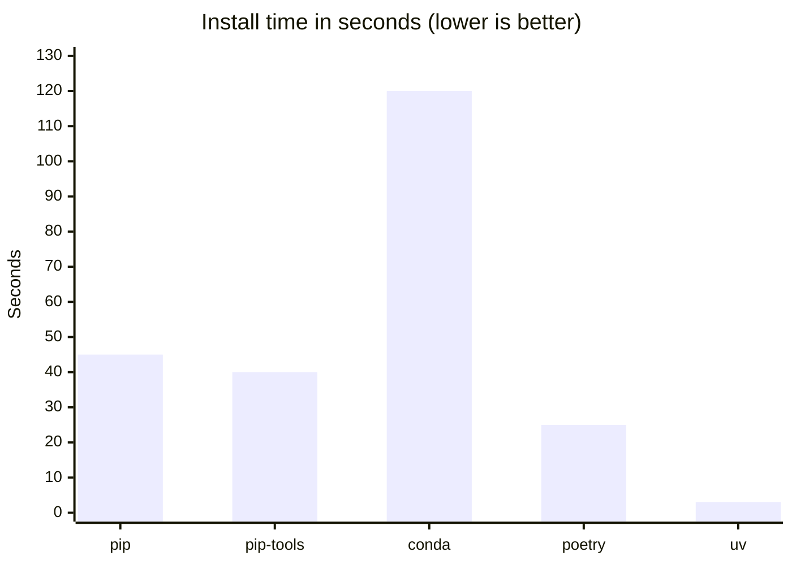

# Project Overview

## Overview

Setting up a Python project has changed significantly over the past two decades. What once required a fragmented mix of configuration files has since converged on a single standard with `pyproject.toml`. Alongside this consolidation, a new generation of developer tools has emerged that takes full advantage of the modern standard. Tools like [uv](https://docs.astral.sh/uv/) and [Ruff](https://docs.astral.sh/ruff/) enable a scalable and streamlined project setup with minimal configuration overhead.

Depsight embraces this modern stack. Metadata, dependencies, build system configuration, and tool settings all live in a single `pyproject.toml`, and `uv` manages the full dependency lifecycle from installation to publishing.

---

## Project Configuration

### Python Project Configuration in the Past

In 1998, `distutils` introduced `setup.py`, an imperative Python script that served as the build entry point for a project. Package metadata such as the `name`, `version`, and `description` were declared as function arguments inside executable code; however, there was no concept of dependency management yet. This changed in 2004 when `setuptools` extended `setup.py` with automatic package discovery and dependency declarations via `install_requires`, though metadata remained executable Python code. Consequently, any tool had to run the file just to read the package name or version, which was both a security risk and a barrier to static tooling.

=== "`setup.py`"
    ```python
    from setuptools import setup, find_packages

    setup(
        name="my-package",
        version="1.0.0",
        description="A sample package",
        packages=find_packages(),
        install_requires=[
            "lxml>=1.0",
            "docutils>=0.4",
        ],
    )
    ```

In 2008, `pip` was released and introduced `requirements.txt` as a convention for pinning exact dependency versions alongside the existing `setup.py`. Some teams also started maintaining a separate `requirements-dev.txt` for development tools like test runners and linters, which meant keeping multiple files in sync manually.

=== "`setup.py`"

    ```python
    from setuptools import setup, find_packages

    setup(
        name="my-package",
        version="1.0.0",
        description="A sample package",
        packages=find_packages(),
        install_requires=[
            "requests>=1.0",
        ],
    )
    ```

=== "`requirements.txt`"

    ```text
    requests==1.2.3
    ```

=== "`requirements-dev.txt`"

    ```text
    pytest==2.3.5
    flake8==2.0
    ```

In late 2016, `setuptools 30.3` introduced full support for declarative metadata in `setup.cfg`, moving all package metadata out of executable Python code and into a static configuration file. Runtime dependencies could be declared under `[options] install_requires`, and development extras under `[options.extras_require]`, installable via `pip install -e ".[dev]"`.

However, the entries under `install_requires` and `extras_require`only expressed loose constraints and did not pin exact versions. A separate `requirements.txt` (and `requirements-dev.txt`) was therefore still maintained alongside `setup.cfg` to lock exact versions for reproducible installs. And despite all of this, `setup.py` was still required because `pip` internally depended on it. Consequently, removing it would cause installs to fail entirely:

=== "`pip`"

    ```
    $ pip install -e .
    Obtaining file:///{PATH_TO_PROJECT_ROOT}/my-package
    ERROR: file:///{PATH_TO_PROJECT_ROOT}/my-package does not appear to be a Python project: neither 'setup.py' nor 'pyproject.toml' found.
    ```

=== "`uv`"

    ```
    $ uv sync
    error: No `pyproject.toml` found in current directory or any parent directory
    ```

Projects therefore had to keep `setup.cfg`, `setup.py`, `requirements.txt`, and `requirements-dev.txt` in sync manually.

=== "`setup.cfg`"

    ```ini
    [metadata]
    name = my-package
    version = 1.0.0
    description = A sample package

    [options]
    packages = find:
    install_requires =
        requests>=2.18

    [options.extras_require]
    dev =
        pytest>=3.2
        flake8>=3.4
    ```

=== "`setup.py`"

    ```python
    from setuptools import setup
    setup()
    ```

=== "`requirements.txt`"

    ```text
    requests==2.18.4
    ```

=== "`requirements-dev.txt`"

    ```text
    pytest==3.2.3
    flake8==3.4.1
    ```

### Python Project Configuration Nowadays

In 2016 the fragmentation of project configuration across several files ended, since [PEP 517](https://peps.python.org/pep-0517/) and [PEP 518](https://peps.python.org/pep-0518/) introduced `pyproject.toml` as a standard home for build system metadata. [PEP 621](https://peps.python.org/pep-0621/) completed the picture in 2020 by standardising the `[project]` table for package metadata.

The `[project]` table consolidates everything that used to live across `setup.py` and `setup.cfg`, declaring the package name, version, description, and runtime dependencies in one place. The `[build-system]` table tells build frontends like `uv build` or `pip wheel` which backend to delegate to, and the `[tool.*]` tables configure linters, formatters, and test runners without the need for separate configuration files spread across the project. Dependency groups further tighten the setup by isolating development and documentation tools from runtime dependencies, replacing scattered `requirements-dev.txt` files with a structured, first-class concept directly within `pyproject.toml`.

=== "`pyproject.toml`"
    ```toml
    # replaces: setup.py / setup.cfg [metadata] + [options]
    [project]
    name = "depsight"
    version = "0.1.0"
    description = "A modular dependency analysis framework"
    dependencies = [        # replaces: install_requires + requirements.txt
        "click>=8.1.7",
        "rich>=13.7.0",
        "rich-click>=1.7.0",
    ]

    # replaces: setup.py (the build entry point)
    [build-system]
    requires = ["setuptools>=61.0"]
    build-backend = "setuptools.build_meta"

    # replaces: requirements-dev.txt, requirements-docs.txt
    [dependency-groups]
    dev = [
        "mypy>=1.10",
        "pytest>=8.0",
        "ruff>=0.4",
    ]
    docs = [
        "mkdocs>=1.6",
        "mkdocs-material>=9.5",
        "mkdocs-mermaid2-plugin>=1.1",
    ]

    # replaces: pytest.ini / tox.ini
    [tool.pytest.ini_options]
    testpaths = ["tests"]
    pythonpath = ["src"]

    # replaces: .flake8 / tox.ini [flake8]
    [tool.ruff]
    line-length = 120

    [tool.ruff.lint]
    select = ["E", "F", "I"]
    ignore = ["E501"]

    # replaces: mypy.ini
    [tool.mypy]
    strict = true
    ignore_missing_imports = true
    ```

---

## Development Tooling Stack

### Dependency Management

Depsight uses [**uv**](https://docs.astral.sh/uv/) as its package manager. It is implemented in Rust and released by the team behind [Ruff](#linter-and-formatter). uv resolves and installs packages significantly faster than `pip` or any other Python dependency manager, using parallel downloads and a shared global cache. 



Beyond raw speed, uv integrates natively with `pyproject.toml`. Instead of maintaining separate `requirements.txt` files, uv reads dependency groups directly from `[dependency-groups]` and installs exactly what each context needs. A user can run `uv sync` to install the runtime dependencies declared in `[project].dependencies`. Additionally, when passing `--group dev` or `--group docs` to the `uv sync` command, uv installs the corresponding group, while `uv sync --all-groups` brings in everything at once. This makes local development, CI runs, and documentation builds fully reproducible with a single command and no extra tooling.

#### Lockfile

One of `uv`'s most important capabilities is generating and maintaining a lockfile. Running `uv sync` resolves the full dependency graph, that includes both direct and transitive dependencies, and writes the result to `uv.lock`. Committing this file to version control makes the project fully reproducible; thus, every developer, CI run, and production build has `uv` parse the exact versions directly from the lockfile, installing bit-for-bit identical packages.

The excerpt below from Depsight's `uv.lock` shows the entry for `click`, one of its direct dependencies:

- **`version`**: the exact resolved version (`8.3.1`)
- **`source`**: the registry it was fetched from (`pypi.org`)
- **`sdist` / `wheels`**: download URLs with SHA-256 hashes for both the source distribution and the wheel
- **`dependencies`**: transitive dependencies, each with:
    - `name`: the package name (here `colorama`)
    - `marker`: a platform condition restricting when the dependency is required (here Windows only: `sys_platform == 'win32'`)


```toml
[[package]]
name = "click"
version = "8.3.1"
source = { registry = "https://pypi.org/simple" }
dependencies = [
    { name = "colorama", marker = "sys_platform == 'win32'" },
]
sdist = { url = "https://files.pythonhosted.org/.../click-8.3.1.tar.gz", hash = "sha256:12ff478..." }
wheels = [
    { url = "https://files.pythonhosted.org/.../click-8.3.1-py3-none-any.whl", hash = "sha256:981153a..." },
]

# transitive dependency of click (Windows only)
[[package]]
name = "colorama"
version = "0.4.6"
source = { registry = "https://pypi.org/simple" }
sdist = { url = "https://files.pythonhosted.org/.../colorama-0.4.6.tar.gz", hash = "sha256:08695f5..." }
wheels = [
    { url = "https://files.pythonhosted.org/.../colorama-0.4.6-py2.py3-none-any.whl", hash = "sha256:4f1d999..." },
]
```

#### Updating Dependencies

Any dependency change starts in `pyproject.toml` by adding a new package or adjust a version constraint, then run `uv sync`. uv compares the constraints against what is already pinned in `uv.lock` and, if the locked version still satisfies the updated constraint, leaves the lockfile untouched and installs exactly what was already recorded. To explicitly upgrade a specific package to the latest version within its constraint, run `uv lock --upgrade-package click` followed by `uv sync`. To upgrade all packages at once, `uv lock --upgrade` re-resolves the entire dependency graph before installing.

!!! warning "`uv.lock` takes precedence over `pyproject.toml`"
    Bumping `click>=8.1.7` to `click>=8.2.0` in `pyproject.toml` and then running `uv sync` will still install `click 8.3.1` if that is what the lockfile already pins, because `8.3.1` satisfies `>=8.2.0`. The `pyproject.toml` only defines the allowed range — the lockfile determines the actual installed version. Deleting `uv.lock` is not the right solution, as it forces a full re-resolution of all packages from scratch.

---

### Testing

Automated tests verify that the code behaves as expected and catch regressions before they reach other developers or production. Without a test runner, verifying correctness means manually re-running the application after every change — which does not scale and is error-prone. Depsight uses [pytest](https://docs.pytest.org/). A basic test looks like this:

```python
# tests/test_math.py
def add(a: int, b: int) -> int:
    return a + b

def test_add() -> None:
    assert add(2, 3) == 5
    assert add(-1, 1) == 0
```

Running `python -m pytest tests/` discovers and executes all `test_*` functions automatically.

---

### Code Quality Tools

#### Linter and Formatter

Depsight uses [Ruff](https://docs.astral.sh/ruff/) as its linter and formatter. Ruff is implemented in Rust and represents a modern consolidation of the Python tooling ecosystem. It is a full replacement of `flake8`, `isort`, and `black` in a single binary while being significantly faster than any of them. Rather than maintaining separate configuration files like `.flake8` or `tox.ini`, Ruff reads all its settings from `pyproject.toml` under `[tool.ruff]`, keeping the entire project configuration in one place. Running `ruff check` on the following code

```python
import os  # unused import
import sys

x=1+2      # missing whitespace around operator
print(x)
```

produces:

```
error[F401]: `os` imported but unused
error[E225]: missing whitespace around operator
```

Both issues are caught before the code is ever run or reviewed.

!!! info "What is a linter?"
    A linter is a static analysis tool that reads source code without executing it and reports rule violations. Each rule targets a specific category of problem — importing a module that is never used, calling a function with the wrong number of arguments, or writing code that can never be reached. Because the check happens at development time rather than at runtime, bugs are surfaced immediately when the code is written, not weeks later in production. Consistent linting across a team also prevents entire categories of issues from ever entering the codebase.

#### Type Checker

Depsight uses [mypy](https://mypy.readthedocs.io/) as its static type checker. Python is dynamically typed by default, which means type errors only surface at runtime. mypy analyses the code without running it and catches type mismatches, missing attributes, and incorrect function signatures before they can become runtime failures. It replaces the need for a standalone `mypy.ini` configuration file by reading its settings from `pyproject.toml` under `[tool.mypy]`. For a project like Depsight that exposes a plugin API, type annotations enforced by mypy also serve as living documentatio. Callers know exactly what a function expects and returns without having to read the implementation. Running `mypy` on the following code:

```python
def greet(name: str) -> str:
    return "Hello, " + name

result: int = greet("world")  # assigned to int, but greet returns str
print(result.upper())         # int has no upper() — runtime crash waiting to happen
```

produces:

```
error: Incompatible types in assignment (expression has type "str", variable has type "int")
```

The bug is caught statically — no test run required.

!!! info "What is a type checker?"
    A type checker is a static analysis tool that verifies the consistency of type annotations throughout a codebase without executing any code. It traces how values flow through functions and assignments and reports wherever an actual type contradicts the declared one. The key advantage over runtime errors is timing: a type mismatch in an rarely-called function is caught the moment the code is written rather than surfacing months later under specific conditions in production. For library and framework authors, type annotations checked by a tool like mypy also act as a machine-verified contract — anyone calling the API immediately knows what types are expected and what is returned.