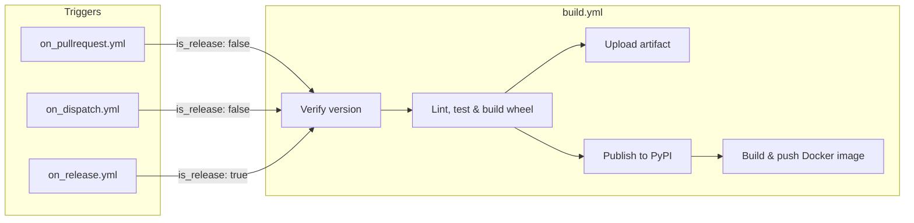

# CI/CD

## Overview

Continuous Integration and Continuous Delivery (CI/CD) automate the steps between writing code and shipping it to users. A CI pipeline typically checks out the source, runs linters, type checkers, and tests, and then builds a distributable artifact. If all checks pass, a CD pipeline publishes the artifact to a package registry, a container registry, or both. Automating these steps eliminates manual errors, enforces quality gates on every change, and ensures that the released artifact is always built from a known-good state of the codebase.

The Depsight project uses [GitHub Actions](https://docs.github.com/en/actions) for its CI/CD pipeline. GitHub Actions is a workflow automation platform built into GitHub that executes jobs in response to repository events such as pushes, pull requests, and releases. Workflows are defined as YAML files inside the `.github/workflows/` directory and run on GitHub-hosted virtual machines. A typical `.github` folder looks like this:

```
.github/
├── actions/            # composite actions shared across workflows
├── scripts/            # shell or Python scripts called from run: steps
└── workflows/
```

---

## GitHub Actions Workflows

Depsight provides three entry-point workflows that trigger the CI/CD pipeline:

- **On Pull Request** — quality gate on every PR to `main`; lints, type-checks, tests, and builds the wheel without publishing
- **On Dispatch** — manual trigger for on-demand builds; supports toolchain version selection and optional wheel artifact upload
- **On Release** — fires on a published GitHub Release; publishes the wheel to PyPI and pushes the Docker image to Docker Hub

Each responds to a different GitHub event and delegates the heavy lifting to `build.yml` via `workflow_call`. The entry points differ in how they determine version numbers, which inputs they forward, and whether they trigger a release publish.

### On Pull Request

The `on_pullrequest.yml` workflow runs automatically when a pull request is opened or updated against the `main` branch. It parses the current version from `pyproject.toml` and calls `build.yml` with `is_release: false`, which means the pipeline lints, type-checks, tests, and builds the wheel but does not publish anything. Changes to `README.md` and the `docs/` folder are excluded via `paths-ignore` so that documentation-only PRs do not trigger a full build.

```yaml
on:
  pull_request:
    branches:
      - main
    paths-ignore:
      - 'README.md'
      - 'docs/**'
```

### On Dispatch

The `on_dispatch.yml` workflow is triggered manually from the GitHub Actions UI. It exposes several inputs that let the operator choose the Python version, the `uv` version, and whether the wheel should be uploaded as a downloadable workflow artifact. Like the pull request workflow, it calls `build.yml` with `is_release: false`, so nothing is published to PyPI or Docker Hub. This workflow is useful for testing a specific configuration or producing a pre-release wheel for local validation.

```yaml
on:
  workflow_dispatch:
    inputs:
      depsight_version:
        description: "Depsight version (must match pyproject.toml, e.g. 1.0.0)"
        required: true
        type: string
      python_version:
        description: "Python version used for the build"
        required: false
        default: "3.12"
        type: choice
        options:
          - "3.12"
          - "3.13"
      uv_version:
        description: "uv version to install in the DevContainer (e.g. 0.10.9)"
        required: false
        default: "0.10.9"
        type: string
      upload_artifact:
        description: "Upload the wheel as a workflow artifact"
        required: false
        default: false
        type: boolean
```

### On Release

The `on_release.yml` workflow fires when a GitHub Release is published. It first verifies that the release tag is [PEP 440](https://peps.python.org/pep-0440/) compliant, then calls `build.yml` with `is_release: true`. This flag enables the publish steps that upload the wheel to PyPI and push the Docker image to Docker Hub. The workflow also forwards the `PYPI_TOKEN` and `DOCKER_PAT` secrets so that the reusable workflow can authenticate with both registries.

```yaml
on:
  release:
    types: [published]
```

### Reusable Build Workflow

The `build.yml` workflow is the single source of truth for all build, test, and publish logic. It is never triggered directly by a repository event. Instead, the three entry-point workflows call it via `workflow_call`, passing the version, toolchain pins, and the `is_release` flag that controls whether artifacts are published.



The workflow accepts the following inputs and secrets:

| Input / Secret      | Type      | Purpose                                              |
|----------------------|-----------|------------------------------------------------------|
| `is_release`         | boolean   | Enables PyPI and Docker Hub publish steps            |
| `uv_version`         | string    | `uv` version to install in the DevContainer          |
| `python_version`     | string    | Python base image tag                                |
| `depsight_version`   | string    | Expected version (validated against `pyproject.toml`) |
| `upload_artifact`    | boolean   | Attach the wheel as a downloadable workflow artifact |
| `PYPI_TOKEN`         | secret    | API token for PyPI publishing                        |
| `DOCKER_PAT`         | secret    | Personal access token for Docker Hub                 |

---

## Build and Publish Steps

### Version Verification

Before any build work begins, the workflow compares the `depsight_version` input against the version declared in `pyproject.toml`. If they do not match, the pipeline fails immediately. This prevents accidental releases with mismatched metadata.

### Building the Wheel

The Depsight wheel is built inside the same [DevContainer](../development/dev-environment.md) that is used for local development. The `devcontainers/ci` action spins up the container image defined in `.devcontainer/devcontainer.json` on the GitHub runner, ensuring the CI environment is identical to the local development setup. Inside this container the step runs the full quality pipeline including linting, type checking, and functional tests. The package build is only executed if everything passes.

```yaml
- name: Lint, test & build wheel
  uses: devcontainers/ci@v0.3
  with:
    configFile: .devcontainer/devcontainer.json
    runCmd: |
      set -e
      source .venv/bin/activate
      ruff check src/ tests/
      mypy src/
      python -m pytest tests/ -v --tb=short
      uv build
```

### Uploading as a Workflow Artifact

When `upload_artifact` is set to `true` in the dispatch inputs, the wheel is attached to the workflow run with a 14-day retention period. This is useful for testing a pre-release build without publishing it to PyPI.

```yaml
- name: Provide wheel as workflow artifact
  if: ${{ inputs.upload_artifact }}
  uses: actions/upload-artifact@v4
  with:
    name: depsight-wheel
    path: dist/*.whl
    retention-days: 14
    if-no-files-found: error
```

### Publishing to PyPI

On release builds (`is_release: true`), the wheel is published to PyPI using the official `pypa/gh-action-pypi-publish` action. The traditional upload tool is [`twine`](https://twine.readthedocs.io/), but `uv publish` and the `pypa/gh-action-pypi-publish` action both handle the upload without requiring a separate install. The `PYPI_TOKEN` secret must be configured in the repository settings.

```yaml
- name: Upload wheel to PyPI
  if: ${{ inputs.is_release }}
  uses: pypa/gh-action-pypi-publish@release/v1
  with:
    password: ${{ secrets.PYPI_TOKEN }}
```

### Setting Up Buildx

[Docker Buildx](https://docs.docker.com/build/buildx/) is a CLI plugin that extends `docker build` with BuildKit features such as multi-platform builds and advanced caching. The workflow initialises it with the official action.

```yaml
- name: Set up Docker Buildx
  if: ${{ inputs.is_release }}
  uses: docker/setup-buildx-action@v3
```

### Authenticating with Docker Hub

The workflow authenticates to Docker Hub using a username stored as a repository variable and a Personal Access Token (PAT) stored as a repository secret.

```yaml
- name: Log in to Docker Hub
  if: ${{ inputs.is_release }}
  uses: docker/login-action@v3
  with:
    username: ${{ vars.DOCKER_USERNAME }}
    password: ${{ secrets.DOCKER_PAT }}
```

!!! info "Docker Hub Credentials"
    `DOCKER_USERNAME` is configured as a repository **variable** and `DOCKER_PAT` as a repository **secret**. The PAT requires the **Read & Write** permission scope for the target repository on Docker Hub.

### Building and Pushing the Docker Image

The image is built and pushed in a single step using `docker/build-push-action`. The Python and `uv` versions are forwarded as build arguments so the image matches the versions used in the CI test environment. Two tags are applied: the exact release version and `latest`.

```yaml
- name: Build and push Docker image
  if: ${{ inputs.is_release }}
  uses: docker/build-push-action@v6
  with:
    context: .
    push: true
    build-args: |
      PYTHON_VERSION=${{ inputs.python_version }}
      UV_VERSION=${{ inputs.uv_version }}
    tags: |
      ${{ vars.DOCKER_REPOSITORY }}:${{ inputs.depsight_version }}
      ${{ vars.DOCKER_REPOSITORY }}:latest
```
