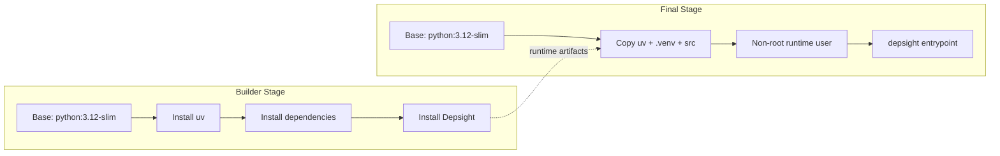

# Containerization

## Overview

Software containers have become an integral part of the modern software development landscape. They bundle an application with its runtime and dependencies into a portable unit that runs consistently across environments. Container engines such as [Docker](https://www.docker.com/) and [Podman](https://podman.io/) build and run these images on developer machines, CI runners, and cloud platforms.

The Depsight project leverages containerization for its terminal application by packaging the CLI into a portable Open Container Initiative (OCI) image. The top-level `Dockerfile` is the build recipe that installs `depsight` into a slim Python base image, which is then published to [Docker Hub](https://hub.docker.com/) alongside the wheel on PyPI.

---

## Container Ecosystem

### Docker Official Images

Docker maintains a curated library of [Official Images](https://hub.docker.com/search?image_filter=official) on Docker Hub. These images follow best practices, receive regular updates, and serve as trusted base layers for application containers. For Python projects, the most commonly used variants are the full `python:<version>` image and its leaner counterpart `python:<version>-slim`, which ships a minimal Debian installation with only the packages required to run CPython.

Depsight builds on top of `python:3.12-slim`. The slim variant keeps the image small while still providing the standard library, `pip`, and the shared libraries needed to install compiled packages. Using an official image also means that security patches flow in through regular upstream rebuilds without requiring manual intervention.

### Dockerfile Architecture

#### Container Build Primitives

The `Dockerfile` is composed of a small set of instructions that together define the build and runtime behavior of the image. The following subsections describe the primitives used in the Depsight Dockerfile.

##### `ARG`

`ARG` declares a build-time variable that can be passed via `--build-arg` on the command line. It only exists during the build and is not available at container runtime. Depsight uses `ARG` to parameterize the Python version, the `uv` version, and the non-root user identity so that the CI pipeline or a developer can pin exact versions without editing the Dockerfile.

| Argument           | Default     | Purpose                              |
|--------------------|-------------|--------------------------------------|
| `PYTHON_VERSION`   | `3.12`      | Base Python image tag                |
| `UV_VERSION`       | `0.10.9`    | `uv` installer version              |
| `USER_ID`          | `1000`      | UID for the non-root runtime user    |
| `USER_NAME`        | `depsight`  | Username for the non-root runtime user |

##### `RUN`

`RUN` executes a command inside the build container and commits the resulting filesystem change as a new image layer. Each `RUN` instruction creates one layer, so chaining related commands with `&&` reduces layer count and image size. In the builder stage, `RUN` installs system packages, downloads `uv`, and runs `uv sync` to install dependencies and the project.

##### `COPY`

`COPY` transfers files from the build context (or from a previous stage via `--from`) into the image. Depsight copies `pyproject.toml` and `uv.lock` before copying `src/` so that Docker can cache the dependency layer independently. In the final stage, `COPY --from=builder` selectively pulls the virtual environment and `uv` binaries without carrying over the build-time toolchain.

##### `ENTRYPOINT`

`ENTRYPOINT` sets the default executable for the container. When a user runs `docker run depsight:local --help`, Docker invokes the entrypoint binary with `--help` as its argument. Depsight sets `ENTRYPOINT ["depsight"]` so the container behaves like a direct invocation of the CLI.

#### Multi-Stage Builds

##### Introduction

A [multi-stage build](https://docs.docker.com/build/building/multi-stage/) splits a Dockerfile into multiple `FROM` stages. Each stage starts from its own base image and can selectively copy artifacts from a previous stage. The main advantage is image size. Build-time tools, compilers, and intermediate files never end up in the final image because they are discarded when the stage completes.

Depsight uses two stages. The **builder** stage starts from `python:3.12-slim`, installs `uv` and all project dependencies, and then installs `depsight` itself. The **final** stage starts from a fresh `python:3.12-slim` image and copies only the runtime artifacts (the `uv` binaries, the virtual environment, and the plugin source) from the builder. This keeps build-time dependencies such as `curl` and the full source tree out of the shipped image.



##### Builder Stage

The builder stage starts from `python:3.12-slim`, installs [`uv`](https://docs.astral.sh/uv/) via its official installer script, and then builds the project inside a virtual environment.

```dockerfile
ARG PYTHON_VERSION=3.12
FROM python:${PYTHON_VERSION}-slim AS builder

ARG UV_VERSION=0.10.9
RUN apt-get update \
    && apt-get install -y --no-install-recommends curl \
    && rm -rf /var/lib/apt/lists/* \
    && curl -LsSf https://astral.sh/uv/${UV_VERSION}/install.sh | UV_INSTALL_DIR=/usr/local/bin sh

WORKDIR /depsight
```

Dependencies are installed **before** copying the source code. Docker caches each layer independently, so as long as `pyproject.toml` and `uv.lock` have not changed, the dependency layer is reused and only the final project install is re-run.

```dockerfile
# Copy dependency config first (cache layer for dependency install)
COPY pyproject.toml uv.lock ./

# Install dependencies only (not the project itself)
RUN uv sync --frozen --no-install-project

# Copy source code
COPY src/ src/

# Install the project (reuses cached dependency layer above)
RUN uv sync --frozen
```

!!! tip "Layer Caching"
    Splitting `uv sync` into two steps — dependencies first, then the project — means that a source-only change rebuilds only the last layer. This significantly speeds up iterative builds during development.

##### Final Stage

The final stage starts from a fresh `python:3.12-slim` image and copies only what is needed at runtime.

```dockerfile
ARG PYTHON_VERSION=3.12
FROM python:${PYTHON_VERSION}-slim

WORKDIR /depsight

# Create non-root user
ARG USER_ID=1000
ARG USER_NAME=depsight
RUN groupadd -g ${USER_ID} ${USER_NAME} && \
    useradd -u ${USER_ID} -g ${USER_NAME} -m -s /bin/bash ${USER_NAME}

# Copy uv binaries from the builder stage
COPY --from=builder /usr/local/bin/uv /usr/local/bin/uvx /usr/local/bin/

# Copy the virtual environment (includes the installed project + dependencies)
COPY --from=builder /depsight/.venv /depsight/.venv

# Copy only the plugin source needed at runtime
COPY --from=builder /depsight/src /depsight/src
```

The container runs as a **non-root user** (`depsight`) and exposes the CLI as its entrypoint.

```dockerfile
RUN mkdir -p /home/${USER_NAME}/.depsight/logs /home/${USER_NAME}/.depsight/data && \
    chown -R ${USER_NAME}:${USER_NAME} /depsight /home/${USER_NAME}

USER ${USER_NAME}

ENV PATH="/depsight/.venv/bin:$PATH"
ENV PYTHONPATH="/depsight/src"
ENV PYTHONUNBUFFERED=1

ENTRYPOINT ["depsight"]
```

---

### Docker Command Primitives

The `docker build` command reads the `Dockerfile` in the current directory, executes both stages, and tags the resulting image as `depsight:local`. This image exists only on the local machine and is not pushed to any registry.

```bash
docker build -t depsight:local .
```

The `docker run` command creates a short-lived container from the local image. The `--rm` flag removes the container automatically after it exits. Any arguments after the image name are forwarded to the `depsight` entrypoint, so `--help` and `scan --help` print the CLI and subcommand usage respectively.

```bash
docker run --rm depsight:local --help
docker run --rm depsight:local scan --help
```
