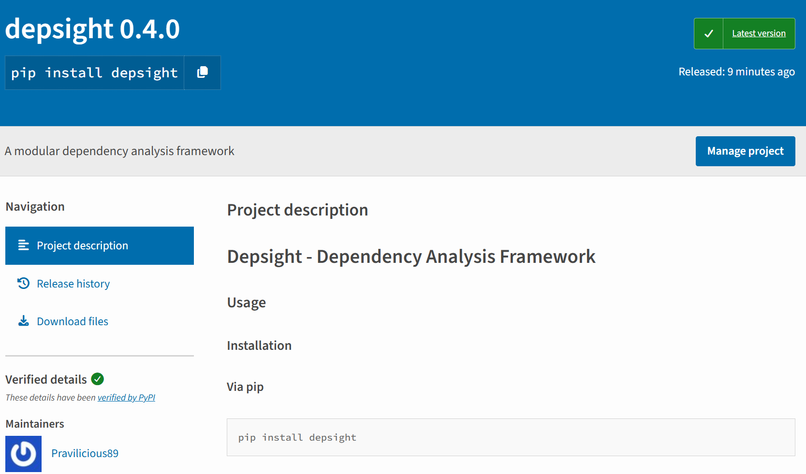

# Packaging

## Overview

The most common way to distribute Python projects is as a **wheel** (`.whl`), a pre-built binary that installs without a build step. A wheel is well suited for developer tools and libraries, but it requires Python and a package manager like `pip` or `uv` to already be present on the target machine. This makes it a poor fit for distributing to end users who are not developers, for shipping to locked-down environments where installing runtimes is restricted, or for desktop applications where a one-click install experience is expected. For those cases, [PyInstaller](https://pyinstaller.org/) and [Nuitka](https://nuitka.net/) produce self-contained executables from a Python project, removing the runtime dependency for the end user. The trade-off is a more complex build environment and toolchain compared to a simple `uv build`.

Depsight is a developer tool designed for learning purposes and does not target any production environment. It is shipped as a wheel and published to [PyPI](https://pypi.org), the standard distribution channel for packages installed via `pip` or `uv`.

---

## Python Wheels

### Wheel Contents

A wheel (`.whl`) is a ZIP archive with a standardised layout. It contains the source code, package metadata, and entry-point declarations — everything an installer needs to place the package into a Python environment without running arbitrary build code.

```
depsight-0.1.0-py3-none-any.whl
├── depsight/
│   ├── __init__.py
│   ├── cli.py
│   ├── commands/...
│   ├── core/...
│   └── utils/...
└── depsight-0.1.0.dist-info/
    ├── METADATA          # Package name, version, dependencies
    ├── entry_points.txt  # CLI + plugin entry points
    └── RECORD            # File checksums
```

The `entry_points.txt` file registers the CLI command and the plugin system. See [CLI Architecture](../development/cli-architecture.md) for details on how entry points wire the plugin registry together.

### Build System

#### Setuptools

[PEP 517](https://peps.python.org/pep-0517/) defines a standard interface between build frontends and build backends. A build frontend is the tool the developer runs — such as `uv build` or `python -m build` — and is responsible for orchestrating the build process. A build backend is the library that does the actual work of compiling metadata and assembling the wheel; it is declared in the `[build-system]` table in `pyproject.toml` and invoked by the frontend.

Depsight uses `setuptools`, the most established Python build backend with the widest tooling compatibility:

```toml
[build-system]
requires = ["setuptools>=61.0"]
build-backend = "setuptools.build_meta"
```

Running the build produces two output files in `dist/`:

=== "uv"
    ```bash
    uv build
    ```

=== "pip"
    ```bash
    python -m build
    ```

This will generate a `*.whl` (binary distribution) and a `*.tar.gz` (source distribution) in the local `dist/` directory:

```
dist/
├── depsight-0.1.0-py3-none-any.whl
└── depsight-0.1.0.tar.gz
```

The generated `.whl` can be directly used to install Depsight locally:

=== "pip"
    ```bash
    pip install dist/depsight-0.1.0-py3-none-any.whl
    ```

=== "uv"
    ```bash
    uv pip install dist/depsight-0.1.0-py3-none-any.whl
    ```

#### Alternatives

**[Hatchling](https://hatch.pypa.io/latest/backend/)** is a modern alternative that reads all metadata directly from `pyproject.toml` with no additional configuration files. It is faster, stricter about standards compliance, and produces reproducible builds by default. Switching is a one-line change:

```toml
[build-system]
requires = ["hatchling"]
build-backend = "hatchling.build"
```

### Publishing to PyPI

[PyPI](https://pypi.org) (the Python Package Index) is the official package registry for Python. It is the registry that `pip install depsight` and `uv tool install depsight` query by default. Every package on PyPI is identified by its `"name"` and `"version"` as declared in `pyproject.toml`. Once uploaded, the wheel is immediately available at `https://pypi.org/project/depsight/` and installable by anyone.



!!! info "PyPI Account and API Token"
    Uploading a package requires an account and an API token. The token is scoped either to the entire account or to a single project, and is passed as a secret during publishing.

---

## CI/CD: Build and Publish Pipeline

The `build.yml` reusable workflow handles building and publishing the wheel. It is called by both the manual dispatch and the release workflow, with `is_release` controlling whether the wheel is pushed to PyPI.

### Building the Wheel

The wheel is built inside the DevContainer using `uv build`. The step runs the full CI pipeline — linting, type checking, tests — and only produces the artifact if everything passes:

```yaml
- name: Lint, test & build wheel
  uses: devcontainers/ci@v0.3
  with:
    configFile: .devcontainer/devcontainer.json
    runCmd: |
      set -e
      source .venv/bin/activate
      ruff check src/ tests/
      mypy src/
      python -m pytest tests/ -v --tb=short
      uv build
```

### Uploading as a Workflow Artifact

When `upload_artifact` is set to `true` in the dispatch inputs, the wheel is attached to the workflow run with a 14-day retention period. This is useful for testing a pre-release build without publishing it to PyPI:

```yaml
- name: Provide wheel as workflow artifact
  if: ${{ inputs.upload_artifact }}
  uses: actions/upload-artifact@v4
  with:
    name: depsight-wheel
    path: dist/*.whl
    retention-days: 14
    if-no-files-found: error
```

### Publishing to PyPI

On release builds (`is_release: true`), the wheel is published to PyPI using the official `pypa/gh-action-pypi-publish` action. The traditional upload tool is [`twine`](https://twine.readthedocs.io/), but `uv publish` and the `pypa/gh-action-pypi-publish` action both handle the upload without requiring a separate install. The `PYPI_TOKEN` secret must be configured in the repository settings:

```yaml
- name: Upload wheel to PyPI
  if: ${{ inputs.is_release }}
  uses: pypa/gh-action-pypi-publish@release/v1
  with:
    password: ${{ secrets.PYPI_TOKEN }}
```